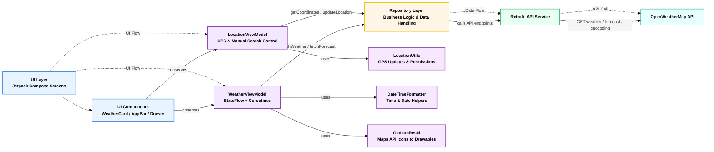

<h1 align="center">🌦️ Mausam – Modern Weather App</h1>

<p align="center">
  
  
  
  
  
</p>

<p align="center">
  <b>A sleek, real-time Weather App built with Jetpack Compose, MVVM, and OpenWeatherMap API ☁️</b><br/>
  <i>Get accurate forecasts, smooth animations, and a dynamic GPS-enabled experience 🌍</i>
</p>

---

## 🌟 Overview

**Mausam** (meaning *“Weather”* in Hindi) is a modern, dynamic, and fully reactive Android weather app built with  
**Jetpack Compose**, **MVVM Architecture**, and **Retrofit2**.

It detects your **current location via GPS**, or lets you **search manually** for any city 🌏 —  
then displays current weather, humidity, wind, and weekly forecasts in a beautiful Material 3 UI.

---

## ⚡ Features

✅ Real-time **Current Weather** & **Weekly Forecasts**  
✅ Dual Location Mode → **GPS Auto Detect** 🌐 or **Manual City Search** 🏙️  
✅ Stunning **Compose Shimmer Loading Animations** ✨  
✅ Smooth **Navigation Drawer + Animated Transitions**  
✅ **MVVM Architecture** (ViewModel + Repository + Flow)  
✅ **OpenWeatherMap API** integration  
✅ **Error Handling** + **Clean Loading States**  
✅ **Responsive UI** for all device sizes  

---

## 🧠 Tech Stack

| Layer | Technology Used |
|-------|------------------|
| 🧩 **Language** | Kotlin |
| 🎨 **UI Toolkit** | Jetpack Compose (Material 3) |
| 🧱 **Architecture** | MVVM (Model–View–ViewModel) |
| ⚙️ **Networking** | Retrofit2 + Gson Converter |
| 📡 **Asynchronous** | Kotlin Coroutines + StateFlow |
| 🗺️ **Location** | Google Play Services (FusedLocationProviderClient) |
| 🖼️ **Image Loading** | Coil + Coil-SVG |
| ✨ **UI Animations** | Compose Shimmer |
| ⚡ **Build System** | Gradle (Kotlin DSL + Version Catalog) |

---

## 🏗️ Project Structure

com.chakravyuh.mausam/
│
├── ApiServices/
│   ├── WeatherApiService.kt
│   └── WeatherRetrofitInstance.kt
│
├── model/
│   ├── CurrentWeatherResponse.kt
│   ├── ForecastResponse.kt
│   └── LocationData.kt
│
├── viewModels/
│   ├── WeatherViewModel.kt
│   └── LocationViewModel.kt
│
├── components/
│   ├── WeatherCard.kt
│   ├── SearchBar.kt
│   ├── AppBar.kt
│   └── ShimmerEffects.kt
│
├── utils/
│   ├── LocationUtils.kt
│   ├── DateTimeFormatter.kt
│   └── GetIconResId.kt
│
└── ui/
├── HomeScreen.kt
└── WeeklyReportScreen.kt

---

## 🛰️ Architecture Diagram


---
# 📸 Screenshots 

<p align="center">


  
</p>

---

# ⚙️ Setup & Installation

1️⃣ Clone this repository

```bash
git clone https://github.com/your-username/Mausam.git
```
2️⃣ Open the project in Android Studio

3️⃣ Add your API key
Go to OpenWeatherMap → get your free API key.
Then in local.properties, add:

```bash
API_KEY=your_api_key_here
```
4️⃣ Build & Run 🚀

---

# 📸 Demo

🎥 Watch the Demo on YouTube

https://youtu.be/aPypfNKVNgI

---

🧩 Future Enhancements
	•	🌙 Add Dark Mode
	•	💾 Offline caching via Room DB
	•	🎬 Shared element animations between screens
	•	🗣️ AI-based weather insights (Gemini/OpenAI)
	•	🌍 Multi-language support

---

## 🧑‍💻 Author

<p align="center">
  
</p>

<h3 align="center">Shivam Mishra</h3>
<p align="center">
  📱 <b>Android Developer</b> | 💻 Kotlin | 🎨 Jetpack Compose Enthusiast  
</p>

<p align="center">
  <a href="https://github.com/Shivam-REPO-2024" target="_blank">
    
  </a>
  <a href="https://www.linkedin.com/in/shivam-kumar-mishra" target="_blank">
    
  </a>
  <a href="https://youtube.com/@binaryshastra?si=4olpuZdKzoawX-aE" target="_blank">
    
  </a>
</p>

---

<h3 align="center">⭐ If you like this project, don't forget to give it a star!</h3>

---
🛠️ License

This project is licensed under the MIT License.

⸻
<h3 align="center">⭐ If you like <b>Mausam</b>, don’t forget to give it a star — it motivates me to build more! ⭐</h3>
```


